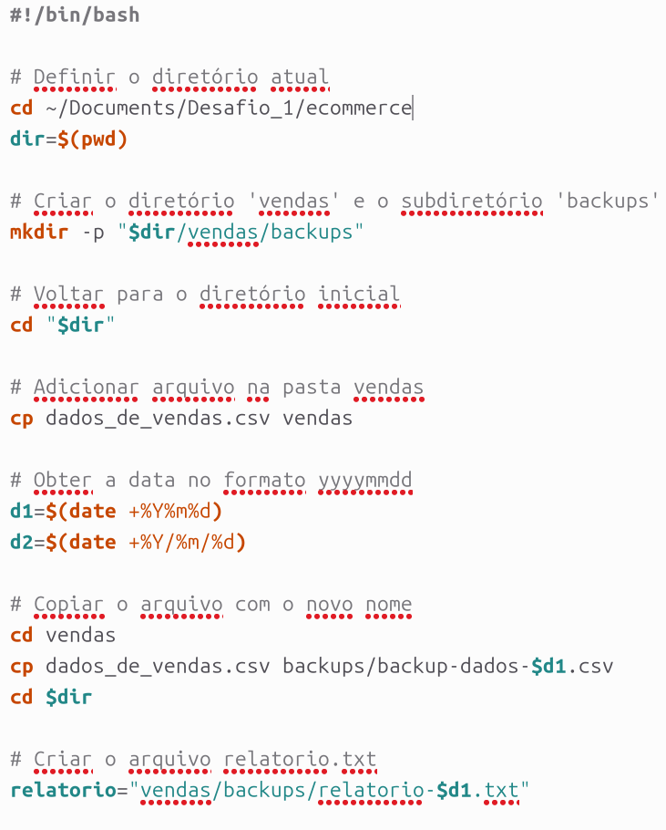
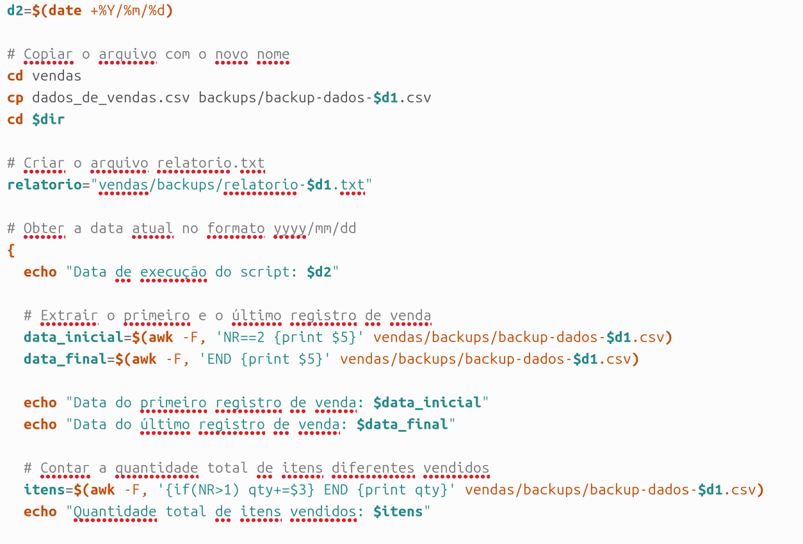
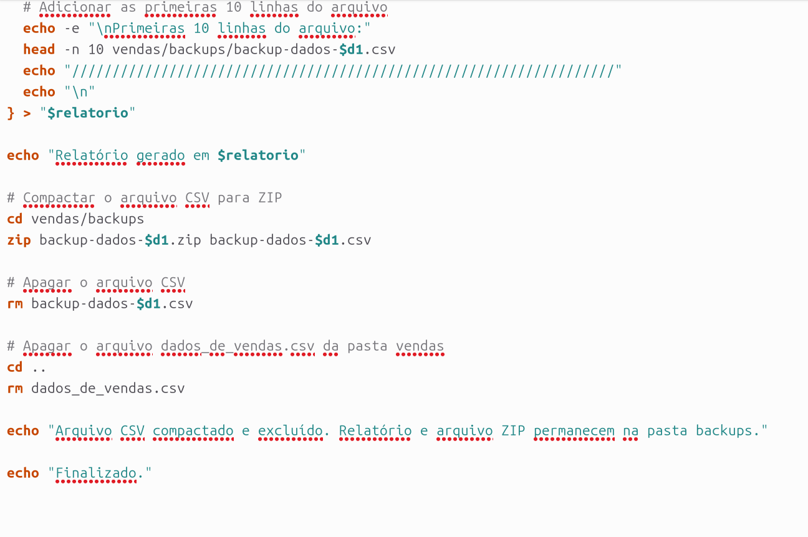

# Sprint 1

Nesse readme eu irei explicar de forma um pouco mais profunda tudo que realizei no decorrer dessa sprint.

# Anotações

Na pasta atividades pode-se observar as anotações realizadas no curso, tanto do curso git quanto linux, 
tendo outras anotações referentes a shell script. Elas foram realizadas ao mesmo tempo que assistia às aulas,
sendo usadas recorrentemente para consulta mediante alguma dúvida.

# Desafio

Ao realizar o desafio encontrei algumas dificuldades com relação ao uso do shell script, contudo, depois de um estudo mais aprofundado, pude realizar o que era pedido. iniciando agora a explicação passo a passo do que foi feito.

## Criação do script processamento
Inicialmente o script iria ser de uma forma, mas ao testar não foi realizado com êxito, então pesquisando um pouco sobre novos comandos, e com uma pequena ajuda da inteligência artificial, consegui consolidar o código.

## Agendamento
Para agendar uma tarefa no linux, é necessario o uso do cron, usando ele, pude programar a atividade para ser realizada no período estipulado em sua data e hora.

## Primeira execução
