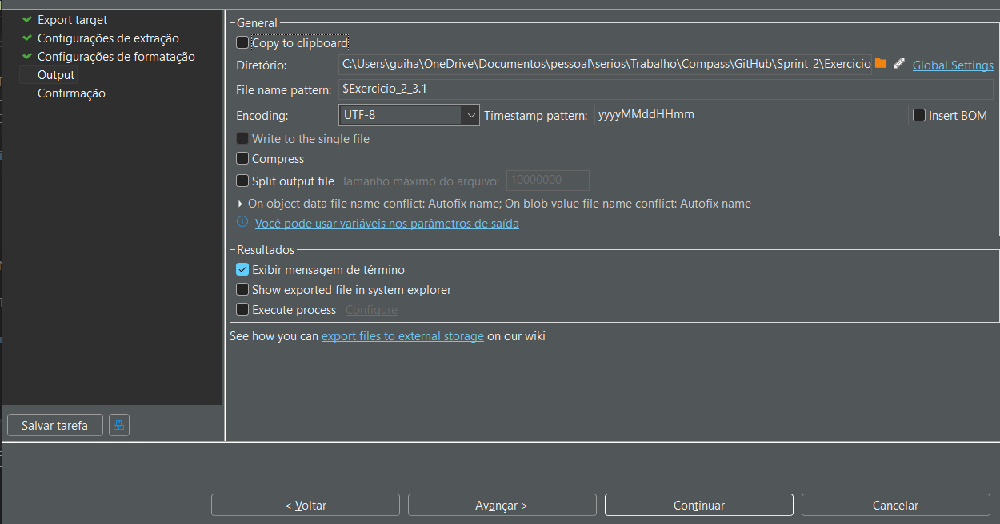
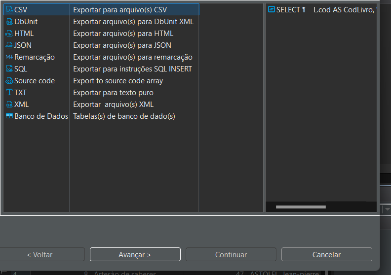
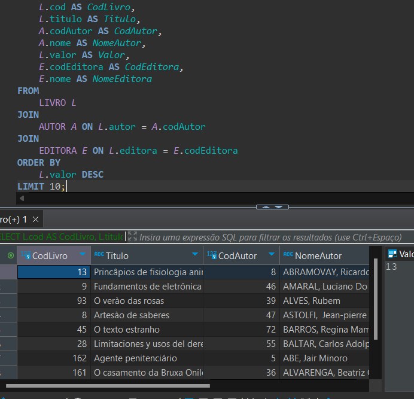
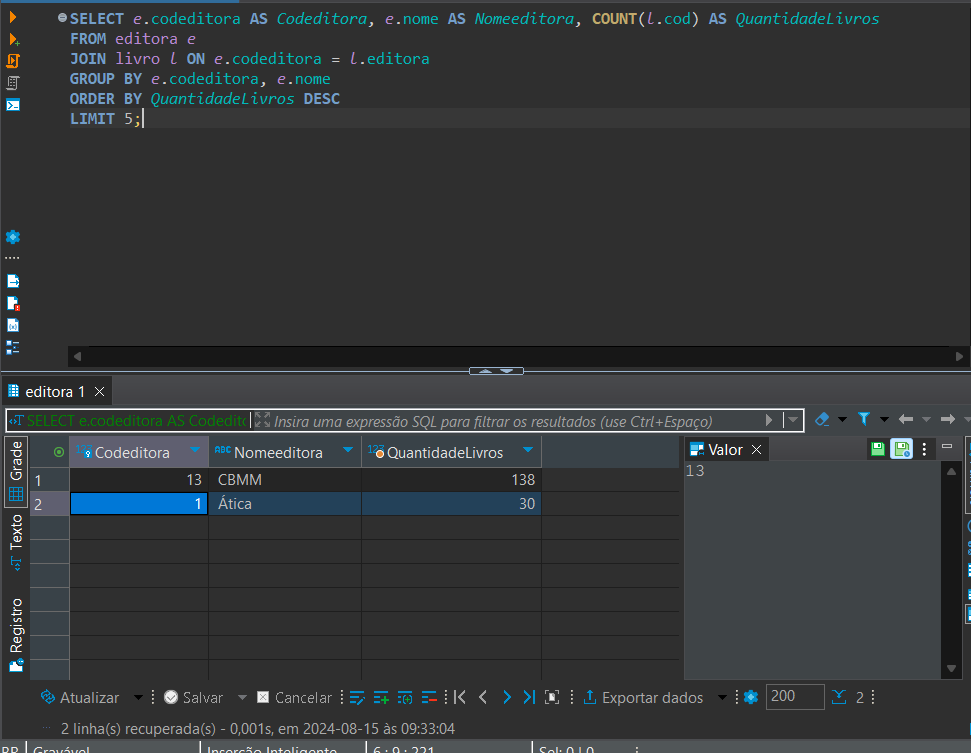
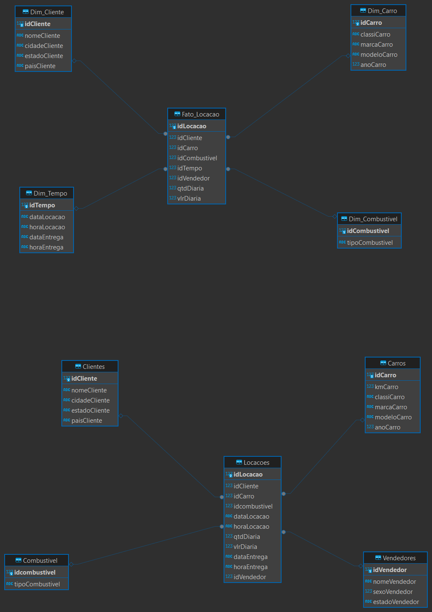

# Aqui começa uma nova Sprint
## explica Rapida do que foi feito na sprint
Nessa sprint tive alguns desafios por não ter conseguido gostar de SQL e o curso AWS não ter sido tão interessante quanto eu achava.
Contudo pude completar tudo de maneira entendivel e deu tudo certo.

### Exercicio

Antes do desafio gostaria de deixar aqui algumas evidências dos exercicios, fazendo o que era pedido neles, registrar o que foi feito

### início do desafio.
O desafio não foi tão desafiador quanto o anterior, mas um gosto pessoal foi que o desafio linux foi mais legal. Para começar, nos 
era dado uma tabela e o desafio pedia que nós "normalizassemos" essa tabela, para um modelo relacional, e posteriormente para um dimensional.
Como primeiro exemplo os códigos que foram usados normalizar estão na pasta desafio.

(pasta desafio)

Para dimensionar o código, foi usado o arquivo .sql da pasta (pasta desafio)

(pasta desafio)

Para finalizar aqui está a apresentação visual das tabelas.

(pasta desafio)
