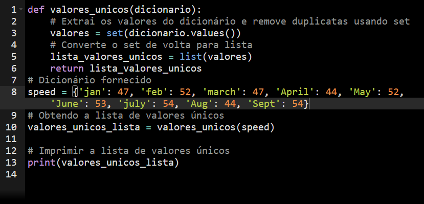

# Sprint_3

Como no desafio já foi usado o markdown, não vejo a necessidade de colocar todos os detalhes aqui de como ele foi feito.
Contudo, irei por meio deste arquivo deixar muito mis facil a visualização dos exercicios.

## Exercicios

### parte_1

(exercicio_1)

(exercicio_2)

(exercicio_3)

(exercicio_4)

(exercicio_5)

(exercicio_6)

(exercicio_7)

(exercicio_8)

(exercicio_9)

(exercicio_10)

(exercicio_11)

(exercicio_12)

(exercicio_13)

(exercicio_14)

(exercicio_15)

(exercicio_16)

(exercicio_17)

(exercicio_18)

(exercicio_19)

(exercicio_20)

(exercicio_21)

(exercicio_22)

(exercicio_23)

(exercicio_24)

(exercicio_25)

### parte_2

(etapa_1)

(etapa_2)

(etapa_3)

(etapa_4)

(etapa_5)

#### resultados

(etapa_4)

(etapa_5)
